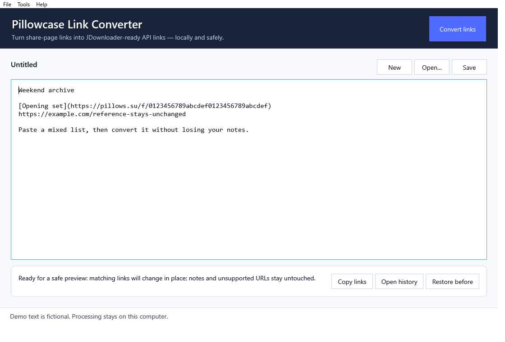
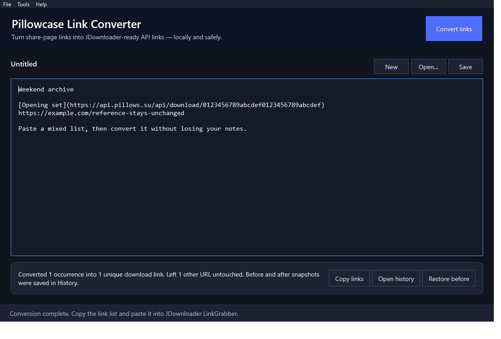

<p align="center">
  
</p>

# Pillowcase Link Converter

A friendly, local Windows app for turning Pillowcase share-page URLs into API download links that can be pasted into JDownloader. The text file is now the app: paste, type, edit, open, save, convert, and restore from one interface.

## See it in action

Start with a mixed document in the light theme. Notes, Markdown, blank lines, ordering, and unrelated URLs can stay in the same editor:



After conversion, the matching link changes in place and the result card reports exactly what happened. Here is the same document in dark mode:



> The app transforms text only. It does not download files, contact Pillowcase, open JDownloader, read cookies, bypass access controls, or inspect linked content.

## When and why to use it

Use it when a list contains `https://pillows.su/f/<32-character-id>` share links but JDownloader needs `https://api.pillows.su/api/download/<32-character-id>` links.

It is especially useful for large lists copied from notes, messages, or Markdown. Matching URLs are replaced **inside the original text**, so headings, notes, blank lines, Markdown, ordering, and repeated links stay where they were.

## Quick start

1. Download the repository ZIP and extract it.
2. Double-click `Build App.cmd` once. This uses Windows' built-in .NET Framework tools—no developer kit or administrator access is required.
3. Open `dist\PillowcaseLinkConverter.exe` (or run `Create Shortcut.cmd`).
4. Paste text into the large editor, or choose **Open** to work with an existing `.txt` file.
5. Choose **Convert links** or press **Ctrl+Enter**.
6. In JDownloader, open **LinkGrabber** and press **Ctrl+V**.
7. Review the detected filenames, sizes, hosts, and availability before starting downloads.

On first launch, the app explains this flow. **Help → How to use** opens it again at any time.

## What the interface protects

- A complete before/after History record is created for every conversion that changes text.
- **System**, **Light**, and **Dark** appearance modes are available in Settings and persist between launches.
- Opened files are updated with a verified atomic replacement; the app asks first by default.
- **Restore before** puts back the snapshot from the last conversion and records the restore.
- UTF-8, UTF-8 BOM, UTF-16, and original CRLF/LF line endings are preserved when a file is opened and saved.
- Already-converted API links are left alone, making repeat runs safe.
- Unsupported URLs stay exactly where they were and are listed in that run's history.
- The clipboard receives a deduplicated list, while the editor and Before/After occurrence lists retain repetitions.

The default history location is `%LOCALAPPDATA%\Pillowcase Link Converter\History`; it can be changed in **Tools → Settings**. The same screen controls automatic clipboard copying, the opened-file warning, and appearance.

## Example

```text
Before: [Song](https://pillows.su/f/0123456789abcdef0123456789abcdef)
After:  [Song](https://api.pillows.su/api/download/0123456789abcdef0123456789abcdef)
```

The sample ID is fictional.

## History layout

Each completed run gets a unique timestamped folder containing `Original Document.txt`, `Converted Document.txt`, occurrence-preserving `Before Links.txt` and `After Links.txt`, deduplicated `Converted Links.txt`, `Unsupported Links.txt`, and `metadata.json` with hashes, encoding details, counts, and completion state. No-op runs do not create History noise.

## Build and test

```powershell
powershell.exe -NoProfile -ExecutionPolicy Bypass -File ".\Build.ps1" -Test
```

The automated suite covers contextual and Markdown replacement, duplicates, unsupported URLs, idempotence, empty input, encoding/BOM/newline round trips, append-only history, atomic replacement, and a 10,000-link batch. The original PowerShell converter remains available through `Run Converter.ps1` for legacy users.

## Privacy and safety

- Processing is entirely local; there are no accounts, telemetry, or network requests.
- The app never reads browser cookies or credentials.
- Do not put secrets in the editor.
- Scan downloaded files before opening them.
- Download only material you are authorized to access.

## Compatibility and status

Windows 10 or 11 with .NET Framework 4.8. The executable and generated shortcut use the included Pillowcase Link Converter app icon.

This project implements a URL-format transformation observed in August 2026. Pillowcase may change its URLs or API behavior without notice. The project is not affiliated with Pillowcase, JDownloader, or AppWork GmbH.

## License

[MIT](LICENSE)
