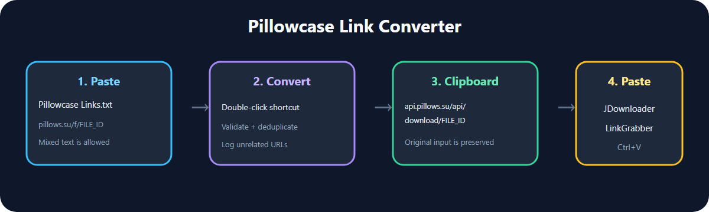

# Pillowcase Link Converter

A small Windows utility that converts Pillowcase landing-page URLs into the corresponding public API download-link format, copies the converted links to the clipboard, and keeps a persistent deduplicated log of unrelated URLs.



## When and why to use it

Use this tool when you have a text list containing URLs in this format:

```text
https://pillows.su/f/0123456789abcdef0123456789abcdef
```

but a download manager such as JDownloader needs the direct API form:

```text
https://api.pillows.su/api/download/0123456789abcdef0123456789abcdef
```

The tool is useful for batches copied from documents, messages, or webpages because it:

- accepts HTTP or HTTPS Pillowcase landing-page links;
- extracts links from plain text and Markdown;
- validates the 32-character hexadecimal file identifier;
- removes duplicate Pillowcase links;
- copies only converted API links to the clipboard;
- logs unrelated URLs in a persistent, deduplicated `Unconverted Links.txt` file; and
- preserves the original `Pillowcase Links.txt` input after every run.

It does **not** download files, open JDownloader, handle cookies, bypass access controls, or verify the safety or legality of linked content.

## Requirements

- Windows 10 or Windows 11
- Windows PowerShell 5.1 or later
- Optional: JDownloader 2 or another download manager that accepts newline-separated direct URLs

## Quick start

1. Download the repository ZIP from GitHub and extract the entire folder.
2. Double-click `Create Shortcut.cmd` once.
3. Open `Pillowcase Links.txt`.
4. Paste a list of original `pillows.su/f/...` links and save the file.
5. Double-click the generated `Pillowcase Link Converter.lnk` shortcut.
6. Read the confirmation message.
7. Open JDownloader, select **LinkGrabber**, and press **Ctrl+V**.
8. Review the detected filenames, sizes, hosts, and availability before starting downloads.

Windows may show a security prompt for scripts downloaded from the internet. Review the scripts before running them. The shortcut uses a per-process PowerShell execution-policy override; it does not change the computer's global execution policy.

## Example

Input copied into `Pillowcase Links.txt`:

```text
Link(s)
[https://pillows.su/f/0123456789abcdef0123456789abcdef](https://pillows.su/f/0123456789abcdef0123456789abcdef)
https://example.com/unrelated-file.zip
https://pillows.su/f/fedcba9876543210fedcba9876543210
```

Clipboard output:

```text
https://api.pillows.su/api/download/0123456789abcdef0123456789abcdef
https://api.pillows.su/api/download/fedcba9876543210fedcba9876543210
```

Persistent `Unconverted Links.txt` entry:

```text
https://example.com/unrelated-file.zip
```

The sample IDs are intentionally fictional.

## Persistent unconverted-link history

`Unconverted Links.txt` is created when needed. New unrelated URLs are merged with the existing list, and duplicates are removed across runs. A later batch with no unrelated URLs does not clear the existing history.

The runtime log and generated `.lnk` shortcut are excluded from Git so private link history and machine-specific paths are not accidentally committed.

## Run without a shortcut

From PowerShell in the project folder:

```powershell
powershell.exe -NoProfile -ExecutionPolicy Bypass -File ".\Run Converter.ps1"
```

## Test

Run the included dependency-free test:

```powershell
powershell.exe -NoProfile -ExecutionPolicy Bypass -File ".\tests\Test-Converter.ps1"
```

Expected result:

```text
All Pillowcase Link Converter tests passed.
```

## Privacy and safety

- Processing occurs locally.
- The converter never reads browser cookies or credentials.
- Do not put secrets in the input text file.
- Inspect download-manager results before starting a batch.
- Scan downloaded files before opening them.
- Download only files you are authorized to access.

## Project status and compatibility

This project implements a URL-format transformation observed in August 2026. Pillowcase may change its URLs or API behavior without notice. The project is not affiliated with Pillowcase, JDownloader, or AppWork GmbH.

## License

[MIT](LICENSE)
